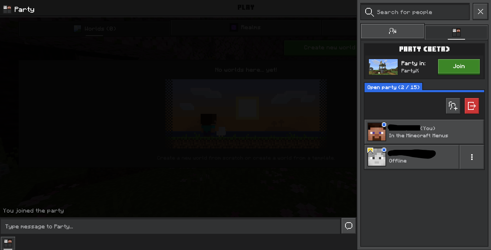

# PartyX
A library to manage Minecraft Parties!

---



---

## Installation
```bash
npm i thejfkvis/PartyX
```

## Usage

### Basic Setup
```javascript
const { Party } = require("partyx");
const { Authflow, Titles } = require("prismarine-auth");

const authflow = new Authflow(undefined, "./auth", {
    flow: "sisu",
    authTitle: Titles.MinecraftNintendoSwitch,
    deviceType: "Nintendo",
    deviceVersion: "0.0.0"
});

const party = new Party({
    authflow,
    clientVersion: "1.26.21",
    privacy: "open",
    restrictInvitesToLeader: false,
    autoConnectRPC: true
});

await party.init();
```

### Creating & Managing Parties

**Create a new party:**
```javascript
await party.init(); // Creates a new party by default
console.log("Party ID:", party.party.id);
```

**Invite a player:**
```javascript
await party.invitePlayer("xbox-user-id");
```

**Leave party:**
```javascript
await party.leaveParty();
```

### Events

Listen to party events:
```javascript
// Party is ready
party.on("ready", ({ partyId, party }) => {
    console.log("Party ready:", partyId, party);
});

// Receive chat messages
party.on("PartyChat_ReceiveChat_v1_0", (params) => {
    console.log(`[${params.Sender}]: ${params.ScanText}`);
});

// RTC connection established
party.on("connected", (rtc) => {
    console.log("Connected to party");
});

// Credentials received
party.on("credentials", (credentials) => {
    console.log("Credentials:", credentials);
});

// System messages
party.on("message", (msg) => {
    console.log("System message:", msg);
});

// PubSub (SignalR) messages
party.on("pubsub_message", (msg) => {
    console.log("PubSub message:", msg)
})

// Errors
party.on("error", (error) => {
    console.error("Party error:", error);
});

// Left party
party.on("left", () => {
    console.log("Left the party");
});
```

### Chat

**Send a chat message:**
```javascript
await party.sendChat("Hello world!");
```

## Options

When creating a Party instance, you can pass these options:

- `authflow` - Prismarine Authflow instance (required)
- `clientVersion` - Minecraft client version (default: "1.26.21")
- `privacy` - Party privacy level: "open" or "closed" (default: "closed")
- `restrictInvitesToLeader` - Only leader can invite players (default: false)
- `autoConnectRPC` - Automatically connect RPC on init (default: true)
- `waitForInvite` - Wait for a invite from a user and automatically accept it (optional)
- `inviteTimeout` - The amount of time to wait for a invite if waitForInvite is enabled (optional)

## Plans
- Join listed opened parties